# HACKTOBERFEST 2022

# AIT E-Library - A library management app

E-Library is an app made with **Flutter** framework and **Firebase** backend.The feature of using flutter app is that it work on android as well as ios devices.
 

It provides book borrowing and library information services to members. It is also used to assist the librarian in maintaining the book catalogue and in book-keeping of fines.One of the main feature on which we are working is user will get a notifictio if the issue period is about to expire.
 

The backend and frontend code is attached and structured in their respective folders. Further instructions are also found inside those folders.
 

Currently the app is under development phase so some feature may not work. Moreover its a flutter app and it needs to be tested in different sized devices.

## Features

  - Author listings and profile.
  - All book listings by genres.
  - Author and book reviews and ratings.
  - Availability of books for borrow.
  - Borrowing books if available.
  - Summary of book/member borrows.
  - Member accounts and profile.
  - FAQ's section.
  - Notification when issue period is about to expire.
  - And much more.

## Screenshot and Screen Recording
  
<kbd></kbd>

    
  

  &nbsp;&nbsp;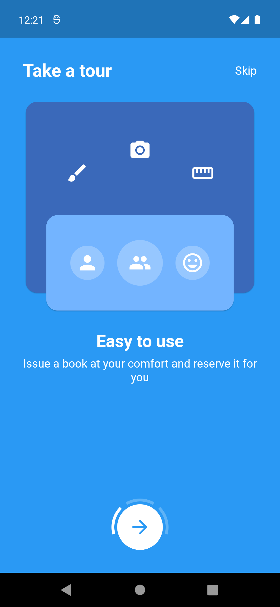&nbsp;&nbsp;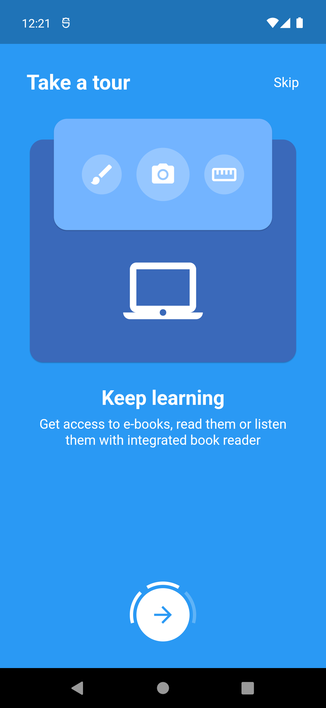  
  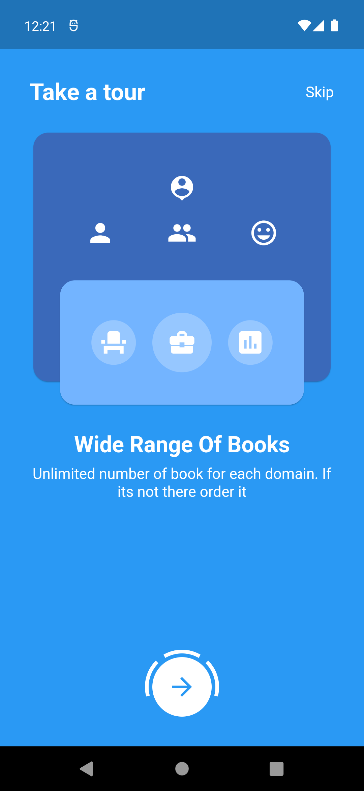&nbsp;&nbsp;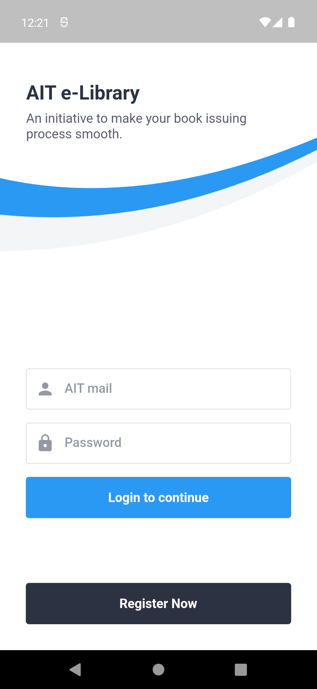&nbsp;&nbsp;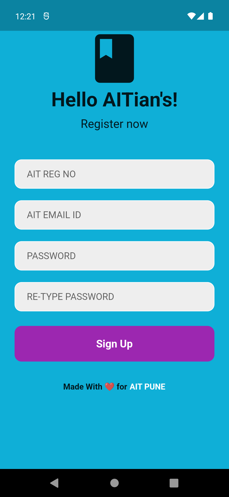  
  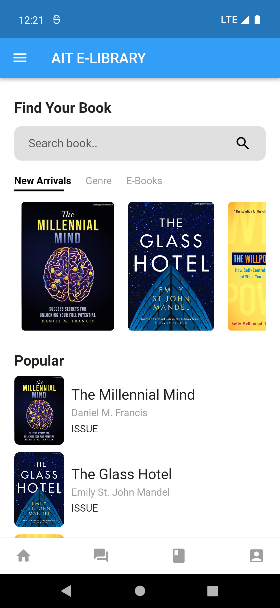&nbsp;&nbsp;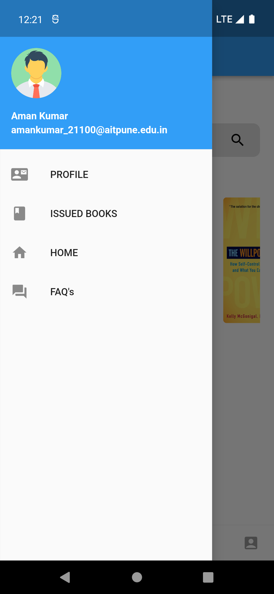&nbsp;&nbsp;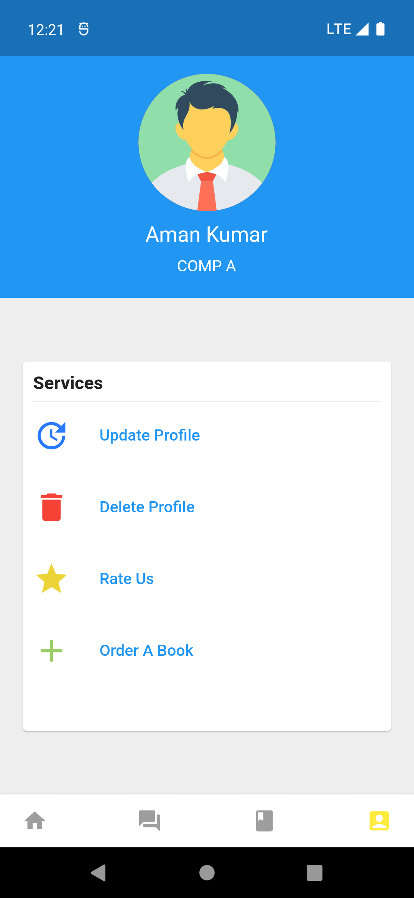  
  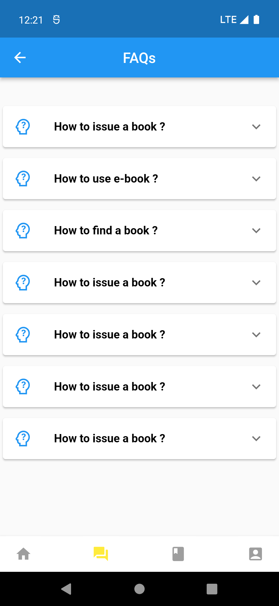&nbsp;&nbsp;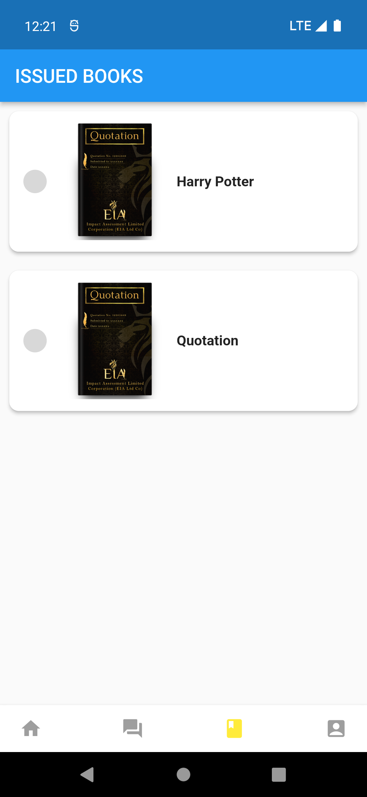&nbsp;&nbsp;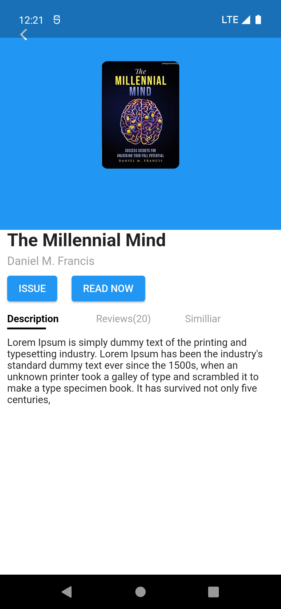  
  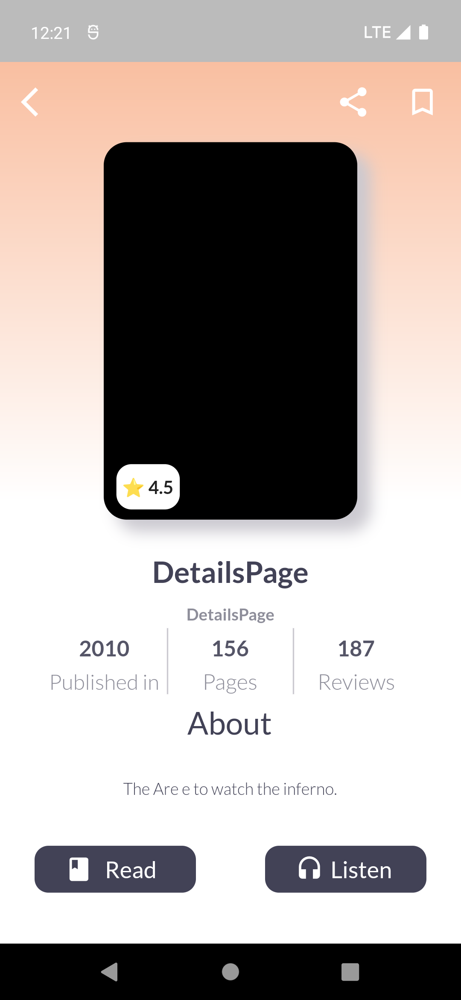&nbsp;&nbsp;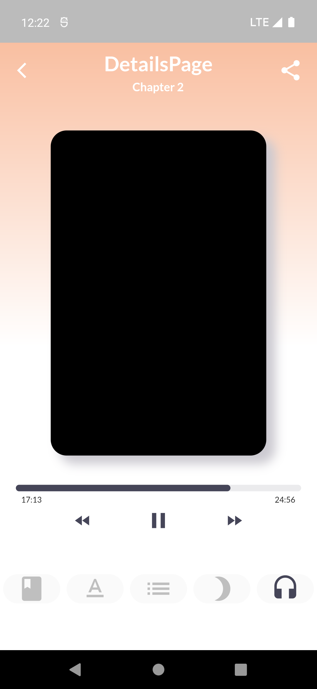&nbsp;&nbsp;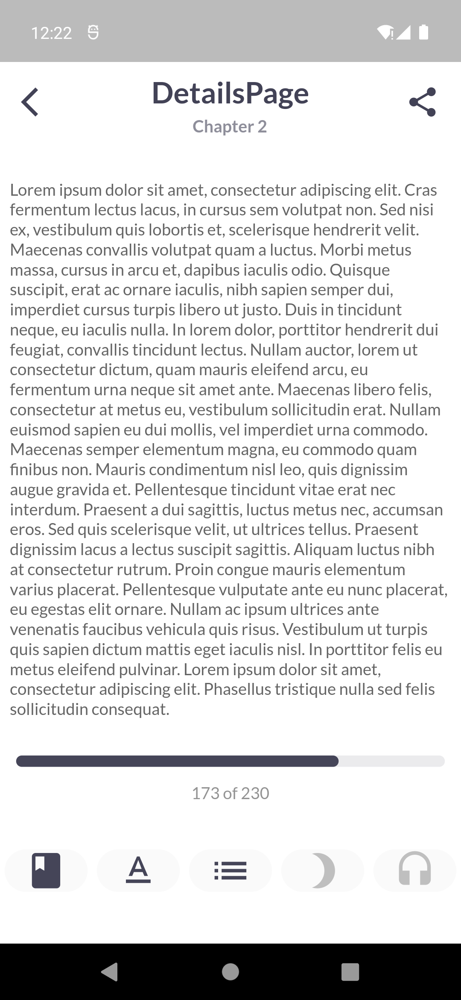  
  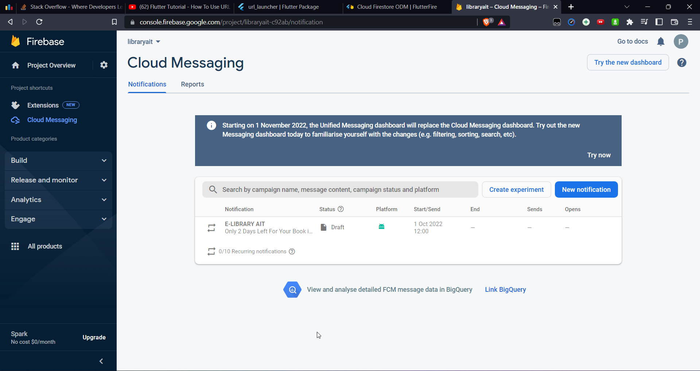  
  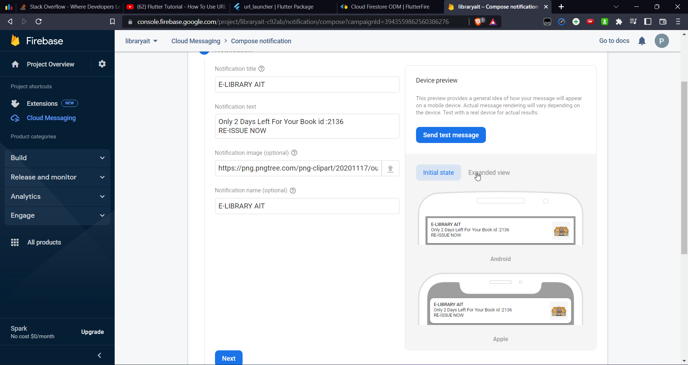  
  

  *New features are to be added in future* ❤︎

## 🚀 Technologies

  - [Flutter v3.3.1]()
  - [Dart v2.18.0]()
  - [Firebase]()
  - Tools used
  - [VS Code and Android Studio]()

## 🤝 Why contribute?
- If you find any bugs then please report them by creating an issue.
- If you can make a website look good by modifying then go ahead and describe it in issue and create pulll requst.
- If you can add more functionality, then create an issue and contribute by making pull request.

## 💬 Feedback

Feel free to send us feedback on [Mail](prikshit4829@gmail.com). Feature requests are always welcome.

## 📝 Apk file link

[GET APK]()

## 📝 Explanation video link

[SEE EXPLANATION]()
